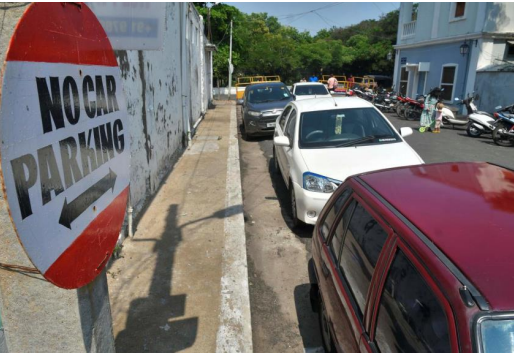
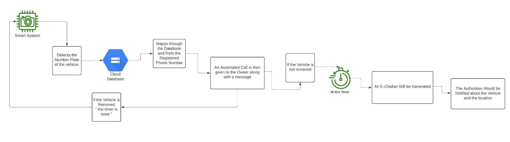

# 🚫 Anti-Parking: Smart Detection of Illegal Parking

  
  

  <em>A Design Thinking approach to solving urban illegal parking problems</em>

---

## 📋 Table of Contents

- [Project Overview](#-project-overview)
- [Problem Statement](#-problem-statement)
- [Research Methodology](#-research-methodology)
- [Conceptual Solution](#-conceptual-solution)
- [Key Findings](#-key-findings)
- [Documentation](#-documentation)
- [Future Scope](#-future-scope)

---

## 🔍 Project Overview

This repository showcases our Design Thinking course project addressing the growing problem of illegal parking in urban areas. We've researched and conceptualized an innovative solution leveraging AI, computer vision, and cloud technology to effectively detect and manage parking violations.

  

---

## ❗ Problem Statement

Illegal parking has become a critical issue in urban cities across India, leading to:

- 🚗 Traffic congestion and reduced mobility
- 💥 Increased accident risks
- 🤬 Street fights and interpersonal conflicts
- ⏱️ Wasted time and resources

> **Research Insight:** 85% of people regularly observe illegal parking, with 65% experiencing direct inconvenience as a result.

---

## 🔬 Research Methodology

Our team applied a comprehensive Design Thinking methodology:

  <table>
    <tr>
      <td align="center"><b>🔎 Secondary Research</b></td>
      <td align="center"><b>👥 Primary Research</b></td>
      <td align="center"><b>🧠 Design Thinking Tools</b></td>
    </tr>
    <tr>
      <td>
        • Analysis of research papers 
        • Case studies (FC Road, Katraj) 
        • News articles on parking conflicts
      </td>
      <td>
        • Interviews with urban residents 
        • Surveys on parking awareness 
        • Field observations
      </td>
      <td>
        • Mind maps 
        • Empathy maps 
        • Persona charts
      </td>
    </tr>
  </table>

---

## 💡 Conceptual Solution

We designed an intelligent detection system with the following workflow:

  

1. **📸 Vehicle Detection**: Camera captures image of illegally parked vehicle
2. **🔢 License Plate Recognition**: AI extracts number plate information
3. **👤 Owner Identification**: System checks vehicle registration database
4. **📱 Automated Warning**: SMS notification with grace period for removal
5. **💰 E-Challan Generation**: Automatic fine issuance for non-compliance
6. **🚜 Towing Integration**: Alerts to towing authorities for persistent violations

### Technologies (Conceptual)

- 🧠 Computer Vision AI models
- ☁️ Cloud databases
- 📨 Automated notification systems
- 🔄 Integration with traffic management infrastructure

---

## 📊 Key Findings

  <table>
    <tr>
      <td><b>80%</b></td>
      <td>Survey respondents agreed a smart detection system would reduce violations</td>
    </tr>
    <tr>
      <td><b>65%</b></td>
      <td>People experience direct inconvenience due to illegal parking</td>
    </tr>
    <tr>
      <td><b>85%</b></td>
      <td>People regularly observe illegally parked vehicles</td>
    </tr>
  </table>

---

## 📑 Documentation

The complete project report is available in this repository as [DT_FINAL_REPORT.pdf](Report\DT_FINAL_REPORT.pdf).

---

## 🔮 Future Scope

While this project focuses on the conceptual design, future development could include:

- 🛠️ Prototype development with actual computer vision implementation
- 🧪 Testing in controlled urban environments
- 🔗 Integration with existing traffic management systems
- 📱 Mobile application for traffic authorities

---

  <i>Note: This project is conceptual in nature and was developed as an academic exercise to apply Design Thinking methodology to a real-world problem.</i>

